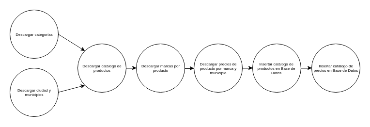

# API QQP

El API QQP es una interfaz publica de consulta que permite a los consumidores de este servicio obtener datos de valor, principalmente precios, relacionados con los productos registrados en la base e datos Quién es Quién en los Precios de [PROFECO](https://www.profeco.gob.mx/precios/canasta/default.aspx).

El proyecto se divide en dos principales bloques:
- ETL QQP
- API QQP

## ETL QQP
Los endpoints originales construidos por PROFECO se encuentra fuertemente ligados a la implementación de su plataforma movil y web y presentan problemas al momento de exponerlas como un API de consumo estandard.

ETL QQP consume los datos expuestos en estos enpoints y los organiza de tal forma que son represendatos en un esquema de datos pensado para consulta y consumo abierto e intensivo de los datos.

Los datos recolectados en cada ejecución del ETL son etiquetados con el timestamp de la fecha en la cual se ejecuto el ETL. El formato corresponde a `Ymd`. Por ejemplo: `20180514` para `14 de Mayo del 2018`.

El ETL se construye de steps o pasos que ejecutan cada una de las tareas necesarias para descargar y procesar los datos de origen. Cada paso o step arroja archivos con el resultado de su ejecución en la carpeta `otuput` del proyecto. Los pasos que componen el ETL es descrito en el diagrama siguiente:



### 1.1 Descargar Categorias
El diseño de datos expuesto por PROFECO refleja que los productos se dividen en grupos principales los cuales a su vez contienen sub categorias y para poder obtener el catalogo completo de productos es necesario descargar esta jerarquia de grupos.

Las peticiones a los endpoints son realizadas mediante consultas GET con parametros de url. Los endpoints usados son los siguientes:
- Categorias principales: http://200.53.148.112:82/jsonApps/qqp_secciones.aspx
- Sub-Categorias tipo A: http://200.53.148.112:82/jsonApps/qqp_subseccion1.aspx
    - Parametros:
        - **seccion**: Nombre de la sección principal obtenida en el endpoint anterior.
- Sub-Categorias tipo B: http://200.53.148.112:82/jsonApps/qqp_subseccion2.aspx
    - Parametros:
        - **subseccion1**: Nombre de la sub-sección obtenida en el endpoint anterior.

El resultado final de este step es la generación del archivo `output/categories-{timestamp}.json`. Ejemplo: `output/categories-20180514.json`.
### 1.2 Descargar ciudad y municipios
Otro rasgo adicional en los datos expuestos por PROFECO es que es necesario consultar la información por ciudad y municipio. Por lo que es requisito descargar el catalogo completo de con el listado de ciudades y municipios registrados en la base de QQP para poder obtener el catálogo completo de productos.

Las peticiones a los endpoints son realizadas mediante consultas GET con parametros de url. Los endpoints usados son los siguientes:
- Endpoint: http://200.53.148.112:82/jsonApps/qqp2.aspx
    - Parametros:
        - **ve**: Operación a realizar (Tiene dos valores).
            - **selecCiudad**
            - **selecMuni**
        - **idCiudad**: Se utiliza para obtener los municipios de una ciudad y solo se usa con `ve=selecMuni`.

El resultado final de este step es la generación del archivo `output/geography-{timestamp}.json`. Ejemplo: `output/geography-20180514.json`
### 2 Descargar catálogo de productos
Una vez que se cuentan con el catalogo de zonas geograficas registradas por profeco y con las categorias registradas el siguiente paso es descargar el catalogo de productos sin precios.

Las peticiones a los endpoints son realizadas mediante consultas GET con parametros de url. Los endpoints usados son los siguientes:
- Endpoint: http://200.53.148.112/json/qqp_subseccionInter.php
    - Parametros:
        - **qqp_subseccion2**: Id de la subcession o subcategoria de productos.
        - **idCiudad**: Id de la ciudad donde se buscaran productos.
        - **idMunicipio**: Id del municipio donde se buscaran productos.

El resultado final de este step es la generación del archivo `output/products-{timestamp}.json`. Ejemplo: `output/products-20180514.json`
### 3 Descargar marcas por producto
Una vez que se cuentan con el catalogo de productos sin precios y las categorias registradas por profeco el siguiente paso es descargar el catalogo de marcas por producto sin precios.

Las peticiones a los endpoints son realizadas mediante consultas GET con parametros de url. Los endpoints usados son los siguientes:
- Endpoint: http://200.53.148.112:82/jsonApps/jsonApps2/qqp_subseccion3.aspx
    - Parametros:
        - **cveProducto**: Id del producto del que se desea obtener sus marcas.
        - **idCiudad**: Id de la ciudad donde se buscaran productos.
        - **idMunicipio**: Id del municipio donde se buscaran productos.

El resultado final de este step es la generación del archivo `output/branded-products-{timestamp}.json`. Ejemplo: `output/branded-products-20180514.json`
### 4 Descargar precios por marca y municipio
Una vez que se cuentan con el catalogo de productos sin precios y marcas registradas por profeco el siguiente paso es descargar la lista de precios por la relación producto/marca.

Las peticiones a los endpoints son realizadas mediante consultas GET con parametros de url. Los endpoints usados son los siguientes:
- Endpoint: http://200.53.148.112/json/listaEst.php
    - Parametros:
        - **idProducto**: Id del producto del que se desea obtener sus precios.
        - **idMarca**: Id de la marca relacionada al producto.
        - **idCiudad**: Id de la ciudad donde se buscaran productos.
        - **idMunicipio**: Id del municipio donde se buscaran productos.

El resultado final de este step es la generación del archivo `output/prices-per-product-{timestamp}.json`. Ejemplo: `output/prices-per-product-20180514.json`
## Especificaciones tecnicas
### Instalación Local
Se deben correr los siguientes comandos para instalar la herramineta ETL.
```sh
git clone git@github.com:vaquer/qqp.git
cd qqp
python setup.py install
```
### Instalación Kubernetes
```sh
git clone git@github.com:vaquer/qqp.git
cd qqp
kubectl apply -f kubernetes/etl.yml
```

### Ejecucion Local del ETL
Una vez dentro de la carpeta de qqp se debe correr el siguiente comando.
```sh
luigi --module qqp.etl.pipeline StartETL --local-scheduler
```

## API QQP

Los principales problemas son desempeño a gran escala, errores en diseño y falta de estandarización, se requiere un paso previo para tener información lista para ser consultada.